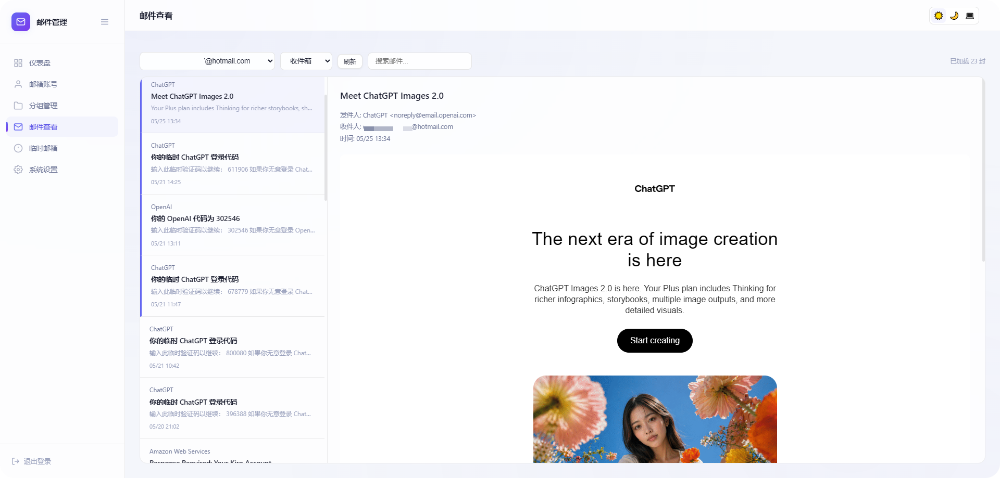

# docker-outlook-email

A self-hosted web dashboard for managing multiple **Outlook, Hotmail, and Live email accounts** from one place.

The application uses Microsoft Graph API to access accounts that you explicitly add and authorize. It can inspect account status, refresh tokens, read mail, search for verification codes, run background batch jobs, send Telegram notifications, and expose API-key-protected endpoints.

This repository is deployed with **Docker Compose, Node.js, and local SQLite storage**.

> This is not an account-registration tool or a mail server. Only use it with accounts you own or are explicitly authorized to manage.

## What It Does

- Manage multiple Outlook, Hotmail, and Live accounts
- Add accounts through Microsoft OAuth
- Import, export, delete, move, and filter accounts in bulk
- Check account health and refresh tokens in background jobs
- Read Inbox, Junk Email, and Deleted Items
- Search messages, extract verification codes, and download attachments
- Organize accounts with groups and tags
- Count messages and clean up invalid accounts
- Continue batch jobs after the browser is closed
- Refresh tokens on a schedule
- Push new messages to Telegram
- Read accounts, messages, and codes through an external API
- Create temporary addresses through GPTMail
- Use Chinese/English UI and dark/light themes

## Screenshots

| Dark | Light |
|:---:|:---:|
|  |  |

## Installation

### 1. Prepare the server

Install:

- Git
- Docker Engine
- Docker Compose v2

Verify the installation:

```bash
docker --version
docker compose version
```

### 2. Download the project

```bash
git clone https://github.com/zzusec/docker-outlook-email.git
cd docker-outlook-email
```

### 3. Create the configuration

```bash
cp .env.example .env
openssl rand -hex 32
vim .env
```

Use the generated random value as `COOKIE_SECRET`, then edit:

```dotenv
ADMIN_PASSWORD=replace-with-a-strong-password
COOKIE_SECRET=paste-the-openssl-output-here
PUBLIC_URL=https://mail.example.com
APP_PORT=8787
BIND_ADDRESS=127.0.0.1
# GPTMAIL_API_KEY=
```

You must replace:

- `ADMIN_PASSWORD`
- `COOKIE_SECRET`
- `PUBLIC_URL`

`PUBLIC_URL` must contain only the scheme, host, and optional port:

```text
https://mail.example.com
```

Do not use a path:

```text
https://mail.example.com/path
```

For temporary direct-IP testing:

```dotenv
PUBLIC_URL=http://YOUR_SERVER_IP:8787
BIND_ADDRESS=0.0.0.0
APP_PORT=8787
```

For production, keep `BIND_ADDRESS=127.0.0.1` and use Nginx or Caddy for HTTPS.

### 4. Build and start

```bash
docker compose up -d --build
```

Check the container and logs:

```bash
docker compose ps
docker compose logs --tail=200 outlook-email
```

Check application health:

```bash
curl http://127.0.0.1:8787/healthz
```

Expected response:

```json
{"ok":true}
```

On first startup, the application creates the SQLite database and applies all pending migrations automatically.

Persistent data is stored in:

```text
./data/outlook-email.db
```

### 5. Sign in

Open the domain configured in `PUBLIC_URL` and sign in with `ADMIN_PASSWORD`.

After the first successful login, a password hash is stored in SQLite. Change the password from the application Settings page. Editing `ADMIN_PASSWORD` later may not replace a password already stored in the database.

## Adding Outlook Accounts

After signing in:

1. Open account management
2. Click **Add Account**
3. Select **One-Click Auth**
4. Sign in through the Microsoft popup
5. Approve access
6. Save the automatically populated credentials

Click **Batch Import** to add accounts by:

- Pasting account text
- Selecting one or more `.txt` files
- Selecting an entire folder and reading the `.txt` files inside it

Each line must use this format:

```text
email----password----client_id----refresh_token
```

The selected files are merged into an editable preview before submission. The application does not impose a per-import cap on TXT file count, account lines, or total text length. Duplicate and invalid lines are skipped and shown in a categorized result summary.

See [API documentation](./docs/API.md) for external integrations.

## HTTPS Reverse Proxy

Nginx example:

```nginx
server {
    listen 443 ssl http2;
    server_name mail.example.com;

    ssl_certificate /path/to/fullchain.pem;
    ssl_certificate_key /path/to/privkey.pem;

    location / {
        proxy_pass http://127.0.0.1:8787;
        proxy_set_header Host $host;
        proxy_set_header X-Forwarded-Host $host;
        proxy_set_header X-Forwarded-Proto $scheme;
        proxy_set_header X-Forwarded-For $proxy_add_x_forwarded_for;
    }
}
```

Set the matching values in `.env`:

```dotenv
PUBLIC_URL=https://mail.example.com
BIND_ADDRESS=127.0.0.1
APP_PORT=8787
```

When using your own Azure application, add this redirect URI:

```text
https://mail.example.com/api/oauth/callback
```

## Updating

The project does not use a remote prebuilt image. Pull the source and rebuild the image on the server.

### Standard update procedure

Enter the project directory:

```bash
cd docker-outlook-email
```

Back up the data:

```bash
docker compose stop
tar -czf ../docker-outlook-email-data-$(date +%F-%H%M%S).tar.gz data
docker compose start
```

Pull the latest source:

```bash
git pull --ff-only
```

Rebuild and start:

```bash
docker compose up -d --build --remove-orphans
```

Verify the update:

```bash
docker compose ps
docker compose logs --tail=200 outlook-email
curl http://127.0.0.1:8787/healthz
```

New database migrations are applied automatically when the container starts.

### Show the current version

```bash
git log -1 --oneline
```

### Roll back code

If an update fails, inspect the logs first:

```bash
docker compose logs --tail=300 outlook-email
```

To temporarily return to an earlier commit:

```bash
git log --oneline -10
git checkout PREVIOUS_COMMIT_ID
docker compose up -d --build --remove-orphans
```

Return to the main branch with:

```bash
git checkout main
```

Restore the pre-update data backup if the database also needs to be rolled back.

## Backup and Restore

### Backup

SQLite runs in WAL mode. Stop the service briefly and archive the entire `data/` directory:

```bash
cd docker-outlook-email
docker compose stop
tar -czf ../docker-outlook-email-data-$(date +%F-%H%M%S).tar.gz data
docker compose start
```

The backup may contain password hashes, Outlook refresh tokens, API keys, Telegram settings, and account data. Store it securely.

### Restore

```bash
cd docker-outlook-email
docker compose stop
mv data data.before-restore
tar -xzf ../docker-outlook-email-data-TIMESTAMP.tar.gz
docker compose up -d
docker compose logs --tail=200 outlook-email
curl http://127.0.0.1:8787/healthz
```

Restore the complete `data/` directory, not only `outlook-email.db`, because WAL/SHM files may also be present.

## Common Commands

```bash
# Status
docker compose ps

# Live logs
docker compose logs -f --tail=200 outlook-email

# Stop and start
docker compose stop
docker compose start

# Restart
docker compose restart outlook-email

# Rebuild
docker compose up -d --build

# Remove containers without deleting ./data
docker compose down
```

Back up the data before maintenance even though `docker compose down` does not remove the bind-mounted `./data` directory.

## Environment Variables

| Variable | Required | Default | Purpose |
|---|:---:|---|---|
| `ADMIN_PASSWORD` | Yes | None | Initial administrator password |
| `COOKIE_SECRET` | Yes | None | Login-cookie signing secret |
| `PUBLIC_URL` | Recommended | Derived from headers | Public origin, OAuth callbacks, and secure cookies |
| `APP_PORT` | No | `8787` | Host port |
| `BIND_ADDRESS` | No | `127.0.0.1` | Host bind address |
| `GPTMAIL_API_KEY` | No | None | GPTMail API key |

Important:

- The container refuses to start without `ADMIN_PASSWORD` or `COOKIE_SECRET`.
- `PUBLIC_URL` cannot contain a path, query, or fragment.
- Changing `COOKIE_SECRET` invalidates all existing login sessions.
- Never commit `.env` or `data/`.

## Background Jobs

The Docker container runs a long-lived Node.js service:

- The token-refresh scheduler wakes every five minutes
- The Telegram scheduler wakes every five minutes
- Background batch account jobs advance every five seconds

Whether a scheduler performs work depends on its settings, interval, and batch size.

Automatic refresh cannot guarantee that a token will remain valid forever. Revoked consent, Microsoft risk controls, account issues, and permission changes can invalidate tokens.

## Migrating from Cloudflare D1

Existing data from the older Cloudflare Workers + D1 deployment can be imported into Docker SQLite.

The export contains sensitive refresh tokens and API keys, and importing is only allowed into an empty application database. Follow the [D1 migration instructions](./docs/DOCKER.md#2-从-cloudflare-d1-迁移已有数据).

## Architecture

```text
Browser
  ↓
Nginx / Caddy (HTTPS)
  ↓
Docker Compose
  ↓
Node.js + Hono
  ├── Static frontend
  ├── Microsoft Graph API
  ├── Background schedulers
  └── SQLite: ./data/outlook-email.db
```

Main directories:

```text
server/                  Node.js entry and SQLite compatibility layer
src/                     Backend logic and API routes
public/                  Static frontend
migrations/              Database migrations
Dockerfile               Docker image definition
docker-compose.yml       Container, ports, and persistence
docker-entrypoint.sh     Container startup script
.env.example             Environment example
docs/                    Docker, API, and supporting documentation
```

## Security Recommendations

- Use a strong administrator password
- Generate and retain a random `COOKIE_SECRET`
- Use HTTPS in production
- Keep `BIND_ADDRESS=127.0.0.1` behind a reverse proxy
- Never publish `.env`, `data/`, or database backups
- Back up the complete `data/` directory regularly
- Only add accounts you own or are authorized to manage
- Register your own Azure application for production use

## Documentation

- [Docker deployment and D1 migration](./docs/DOCKER.md)
- [External API](./docs/API.md)
- [Azure OAuth reference](./docs/GUIDE.md#自己注册-azure-应用)
- [中文 README](./README.md)

## Disclaimer

This project is intended for personal use and for managing email accounts you own or are authorized to access. Do not use it for unauthorized access, data theft, access-control bypass, or unlawful activity. Users are responsible for how they deploy and use the software.

## License

Licensed under [GPL-3.0](./LICENSE). You may use, modify, and redistribute the project, but publicly distributed derivative works must also provide complete source code under GPL-3.0.
